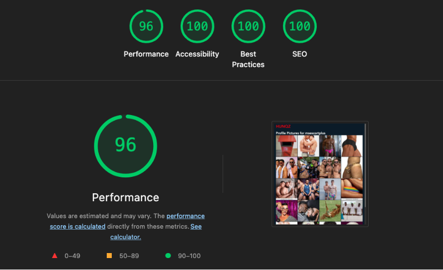
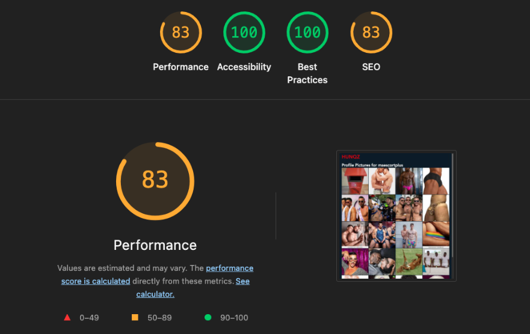

# Design Notes – Monorepo Code Challenge

This document explains the development process of this monorepo implementation.

## Summary of challenge requirements

The goal was to build a monorepo containing:

-   A Next.js app (SSR, SEO-friendly)
-   A React SPA (CSR)
-   A shared module for fetching user profile data from a remote API
    

Both applications needed to:

-   Use TypeScript for type safety
-   Use Tailwind CSS for styling
-   Display fetched profile images
    

Additional constraints:

-   Fetch profile data from a fixed API endpoint
-   Handle CORS restrictions
-   Include minimal unit tests in the shared data fetching module

    
## How I broke the work down

### Step 1 – Get a working monorepo

-   Start from a Turborepo template
-   Ensure apps can run independently
-   Confirm shared packages can be imported correctly
    

### Step 2 – Get data flowing

-   Build a shared profile-service
-   Fetch real API data
-   Handle errors and types in one place
-   Add basic tests (Vitest)
    

### Step 3 – Shared UI

-   Add a reusable UI package
-   Avoid duplicating components between apps
-   Standardise styling across both apps
    

### Step 4 – Build out App functionality

-   Fix CORS in react SPA via proxy setup
-   Add routing
-   Handle app loading + error states

### Step 5 – Polish

-   Tailwind fixes across packages
-   UI refinements (grid, loading states)
-   Lighthouse audits
-   Small refactors and cleanup
    

## Tech choices

### Monorepo tooling

I considered:

-   Turborepo
-   Nx
-   Lerna
    

All are mature technologies with good documentation and valid choices, but I chose Turborepo because:

-   I already had some familiarity with it
-   Fast setup and good developer experience
-   Easy to run multiple apps and shared packages
-   Well supported and widely used

Note: In a real production setup, the decision of which choice to go for would depend as well on team standards, scale, and long-term maintainability.

One things i really like about Turborepo (though this may be true of other monorepo build systems) is that you can define package dependencies in the monorepo root and have your packages/apps use them rather than defining their package dependencies. This is great to ensure consistent versioning. I’ve had projects where a design system app  updated to React 18 and multiple consuming micro-frontends then broke.. It’s good to keep everything on the same version!
    
### Starter choice

I used the "official" Turborepo + Next.js starter from Vercel to avoid spending time on boilerplate and focus on architecture and implementation.

## Challenges

### CORS

The `www.hunqz.com/api/opengrid/profiles` endpoint doesn't allow browser access (no Access-Control-Allow-Origin: \* response header). For the Next-js app this isn’t a problem since currently the data fetching happens on the server, but the react-spa needs to be client side rendered. Luckily Vite allows you to configure a proxy (see apps/react-spa/[vite.config.ts](http://vite.config.ts)). I would expect for production, the endpoint would have some kind of `Access-Control-Allow-Origin: some specific domains` but for development the proxying works nicely.

### Tailwind configuration

I’m not an expert in configuring tailwind so a good chunk of time was spent getting the shared config / styles working. What really helped me here was looking into code examples at [https://github.com/vercel/turborepo/blob/main/examples/with-tailwind/README.md](https://github.com/vercel/turborepo/blob/main/examples/with-tailwind/README.md) and reverse engineering.

### Type Declaration

Without access to API documentation (e.g. Swagger), I had to infer the profile response type from the actual API response. This introduces a small degree of uncertainty, but I think it's okay within the scope of this challenge. In a real project, I'd want to use accurate typings based on documented API contracts.

## AI Usage

I try to treat AI tools as assistants who are really eagar to please, but often don't know the answer and are embaressed to admit it so will make things up. Below are some examples of how i try to use AI in my workflow

### Sounding board/Stack overflow replacement
"Here's an error message i'm getting, here's the stack trace, can you help me debug this?"
"How could i clean up the conditional rendering here"?
"What's a more concise name for this function?"
"Please convert these notes into a README for package X. Use Markdown format, and structure as follows:..."
"Here are tests for the happy path of this function, can you generate some tests for the following unhappy paths..."

Usually there is a back and forth / iteration on the output as it's never good to accept the initial response at face value!

### Code generation via copilot in VSCode
For making dumb components: "Make me a tailwind styled nav bar compontent with 12px padding, 32px min height, 100% of parent width. Tailwind classes should be prefixed with ui:. It should use our design tokens... On desktop it should do X, on mobile Y... It should accept the following props with the following types:.."

Before using the component i would double check what copilot created to make sure it's fit for purpose: Matches requrequirements/syntax conventions, doesn't introducte errors / compatability issues and so on.

## Lighthouse Audits

Next.js  

React  

Room for improvement here. It looks like the hunqz endpoint doesn't accept height/width params for images otherwise I would try requesting at a smaller size.

## Improvements / Iterations

The challenge took me around 8–9 hours in total.

There are of course things that could be improved or expanded on, but there comes a point with timeboxed work where you have to find an appropriate stopping point.

If I had more time, I would look into:

-   Add React Query for caching and request state management
-   Improve error messaging consistency across apps
-   Add runtime schema validation for API responses
-   Improve component test coverage (UI layer)
-   Have design tokens within the ui package (rather than the current mixed approach)